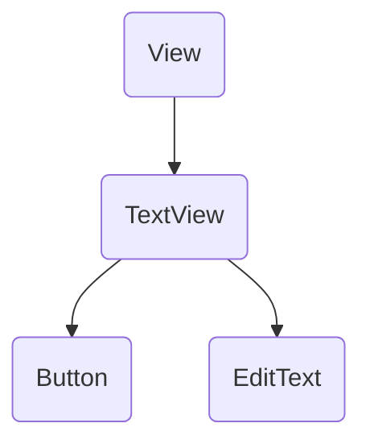

# UI 基础控件 View

## 分类
- 处理文本内容的View（TextView）
- 被点击的View（Button）
- 处理图片内容的VIew（ImageView）
- 接收用户信息输入的View（EditView）
- 进度条类的View（ProgressBar）

## 📚TextView

TextView 类似于Swing中的JLable，对长文本进行显示处理。支持Html，内容有样式链接效果

- `textSize`：设置字体大小
- `textColor`：设置颜色
- `lineSpacingMultiplier`：设置行倍距
- `ScrollView`：让页面变成滚动布局（当文本内容过多时，需要滚动页面来查看所有文本）
- `singleLine`：当设置为true时整个长文本只会显示1行并在最后显示省略号表示后面有省略的文本

**长文本跑马灯实现：**
- `focusable`：当设置为true时可以获取焦点
- `focusableInTouchMode`：当设置为true时即为设置在触摸时获取焦点
- `marqueeRepeatLimit`：设置跑马灯时长

## 📓EditText

- `inputType`：输入内容的类型
	- `textPassword`：密码
	- `number`：只能输入正整数
	- `numberSigned`：只能输入整数
	- `numberDecimal`：只能输入小数
- `maxLength`：限制输入的最大长度
