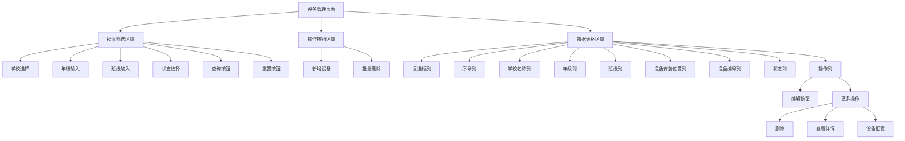
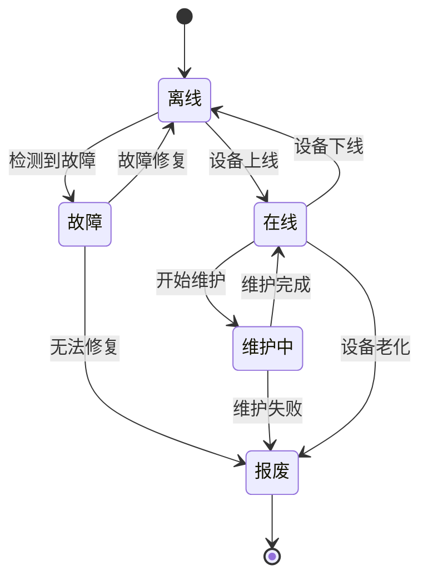
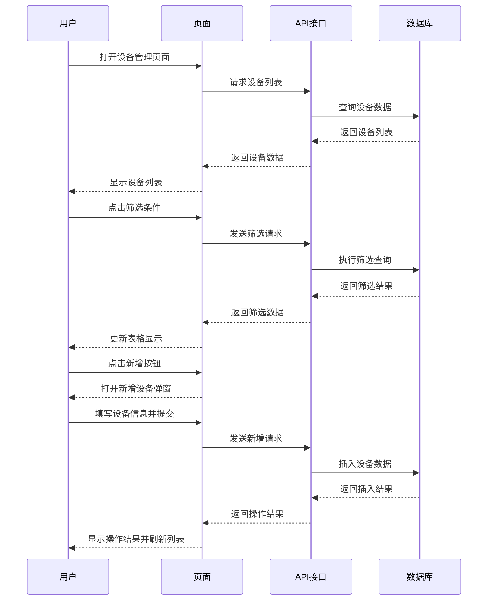
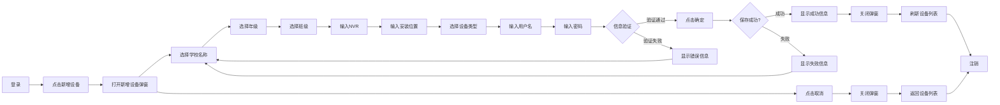
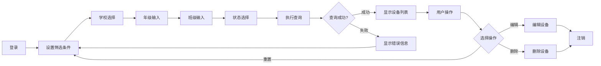
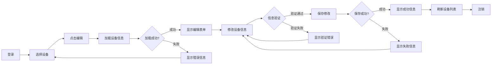
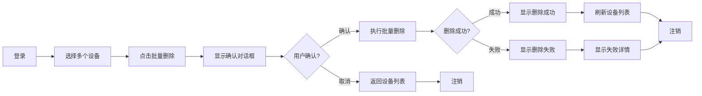
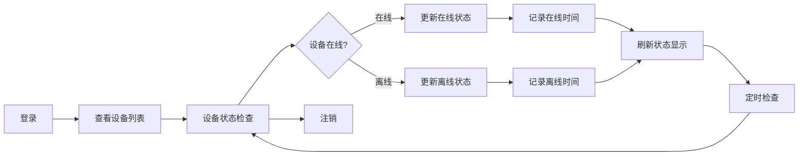
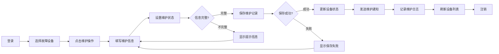

# 设备管理页面逻辑模型图

## 实体关系图 (ERD)

```mermaid
erDiagram
    SCHOOL {
        int school_id PK
        string school_name
        string address
        datetime created_at
        datetime updated_at
    }
    
    GRADE {
        int grade_id PK
        int school_id FK
        string grade_name
        int grade_level
        datetime created_at
        datetime updated_at
    }
    
    CLASS {
        int class_id PK
        int grade_id FK
        string class_name
        string classroom_location
        datetime created_at
        datetime updated_at
    }
    
    DEVICE {
        int device_id PK
        int class_id FK
        string device_number
        string installation_location
        string device_type
        string status
        datetime last_online_time
        datetime created_at
        datetime updated_at
    }
    
    USER {
        int user_id PK
        string username
        string password
        string role
        datetime created_at
        datetime updated_at
    }
    
    SCHOOL ||--o{ GRADE : "has"
    GRADE ||--o{ CLASS : "contains"
    CLASS ||--o{ DEVICE : "installs"
    USER ||--o{ SCHOOL : "manages"
```

## 页面功能流程图



## 数据状态流转图



## 页面交互时序图



## 核心业务逻辑

### 1. 数据层级关系
- **学校** → **年级** → **班级** → **设备**
- 每个层级都有明确的父子关系
- 设备必须归属于某个具体的班级

### 2. 筛选逻辑
- 支持按学校、年级、班级、状态进行筛选
- 筛选条件可以组合使用
- 支持重置所有筛选条件

### 3. 设备状态管理
- **在线**: 设备正常运行
- **离线**: 设备断开连接
- **维护中**: 设备正在维护
- **故障**: 设备出现故障
- **报废**: 设备已报废

### 4. 操作权限
- **查看**: 所有用户都可以查看设备列表
- **新增**: 管理员可以新增设备
- **编辑**: 管理员可以编辑设备信息
- **删除**: 管理员可以删除设备（单个或批量）

### 5. 数据验证规则
- 设备编号必须唯一
- 安装位置不能为空
- 设备必须关联到有效的班级
- 状态变更需要记录时间戳

## 业务线概念数据模型

### 1.1 设备新增业务线



### 1.2 设备查询业务线



### 1.3 设备编辑业务线



### 1.4 设备批量删除业务线



### 1.5 设备状态监控业务线



### 1.6 设备维护管理业务线



## 业务规则说明

### 设备新增规则
- **学校名称**: 必选，从下拉列表中选择
- **年级**: 必选，从下拉列表中选择
- **班级**: 必选，从下拉列表中选择
- **NVR**: 必填，输入NVR设备信息
- **安装位置**: 必填，输入设备具体安装位置
- **设备类型**: 必选，从下拉列表中选择
- **用户名**: 必填，输入设备登录用户名
- **密码**: 必填，输入设备登录密码
- 所有字段都有红色星号标识为必填项
- 验证失败时显示具体错误信息
- 支持取消操作，关闭弹窗返回列表

### 设备查询规则
- 支持多条件组合查询
- 查询结果按设备编号排序
- 分页显示，每页最多20条记录
- 支持导出查询结果

### 设备编辑规则
- 只能编辑非报废状态的设备
- 设备编号修改需要重新验证唯一性
- 状态变更需要记录操作人和操作时间
- 重要字段修改需要二次确认

### 批量删除规则
- 只能删除非在线状态的设备
- 删除前需要用户确认
- 删除操作不可逆
- 记录删除日志

### 状态监控规则
- 每5分钟检查一次设备状态
- 离线超过30分钟的设备标记为异常
- 状态变更实时推送给管理员
- 异常设备自动发送告警通知

### 维护管理规则
- 维护状态需要填写维护原因
- 维护完成后需要填写维护结果
- 维护记录永久保存
- 维护费用需要记录

## 技术实现建议

### 前端技术栈
- **框架**: Vue.js / React
- **UI组件**: Element UI / Ant Design
- **状态管理**: Vuex / Redux
- **HTTP客户端**: Axios

### 后端技术栈
- **框架**: Spring Boot
- **数据库**: MySQL
- **ORM**: MyBatis / JPA
- **缓存**: Redis

### 数据库设计要点
1. 建立合适的索引提高查询性能
2. 使用外键约束保证数据完整性
3. 添加软删除字段支持数据恢复
4. 记录操作日志便于审计追踪
